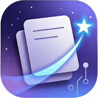

<div align="center">



# ✦ 星 叙 ✦
### Star Narration · xint

*让每一个灵感都有机会长成作品*

[](https://1338032.github.io/Star.Narration.xint/)
[](https://1338032.github.io/Star.Narration.xint/)
[](https://1338032.github.io/Star.Narration.xint/)
[](https://1338032.github.io/Star.Narration.xint/)

<br/>

**[🌐 立即使用](https://1338032.github.io/Star.Narration.xint/)** · **[📦 下载 APK](https://1338032.github.io/Star.Narration.xint/syn.apk)** · **[📖 使用指南](#使用指南)**

<br/>

> 星叙是一款专为**网文创作者**打造的智能写作工具。  
> 无需注册、数据本地存储、永久免费——你的故事，由你掌控。

</div>

---

## ✨ 核心功能

<table>
  <tr>
    <td width="50%">
      <h3>🤖 AI 智能续写</h3>
      <p>接入自定义 AI 接口，根据你的故事风格、人物设定、世界观自动续写。支持流式输出、续写质量评分、一键重试。</p>
    </td>
    <td width="50%">
      <h3>🧵 伏笔追踪器</h3>
      <p>为每一根伏笔建档，追踪埋设位置与回收状态，再也不用担心写着写着把坑忘了。</p>
    </td>
  </tr>
  <tr>
    <td>
      <h3>🗂️ 完整设定管理</h3>
      <p>人物预设、世界观、文风规则、章节大纲……所有创作素材集中管理，AI 续写时自动引用。</p>
    </td>
    <td>
      <h3>📦 资源广场</h3>
      <p>将你的人物、世界观、文风打包成资源包，一键分享或导入社区资源，快速启动新故事。</p>
    </td>
  </tr>
  <tr>
    <td>
      <h3>🎭 角色扮演（RP）</h3>
      <p>与你笔下的角色对话，感受人物性格，探索支线故事，让创作更有温度。</p>
    </td>
    <td>
      <h3>📝 星笺</h3>
      <p>独创灵感便签系统，随手记录碎片想法，自动按标签整理，灵感不再溜走。</p>
    </td>
  </tr>
  <tr>
    <td>
      <h3>⏱️ 时间线管理</h3>
      <p>可视化管理作品内的时间轴，自动检测"同一天从下午跳到上午"等时间逻辑矛盾。</p>
    </td>
    <td>
      <h3>🔬 精华压缩器</h3>
      <p>将长篇内容智能压缩提炼，精准输入 AI 上下文，续写更连贯，不再跑偏。</p>
    </td>
  </tr>
</table>

---

## 🚀 更多亮点

| 功能 | 说明 |
|------|------|
| 🔍 **全局搜索** | 跨所有作品、笔记、伏笔、时间线、收藏夹搜索，一键跳转 |
| 📚 **章节版本管理** | 每章最多保存 20 个历史版本，随时对比或回滚 |
| 🎙️ **TTS 语音朗读** | 沉浸式朗读模式，边听边检查作品节奏 |
| ✍️ **AI 查错别字** | 一键检测全文错别字，点击直接跳转定位 |
| 🌏 **番外篇生成** | 基于已完结作品，一键续写番外故事 |
| 📊 **写作统计** | 字数占比、作品数、创作目标等数据可视化 |
| 🖋️ **文风分析** | 分析你的写作风格特征，统一多部作品的文风 |
| 📱 **沉浸式阅读** | 无干扰全屏阅读模式，专注享受自己的作品 |
| 🔤 **自定义字体** | 内置多款中文字体可选，打造专属阅读体验 |
| 💾 **数据备份还原** | 一键导出全部数据（作品、笔记、设定），安全无忧 |

---

## 🎨 界面主题

星叙内置 **5 种配色方案** × **2 种明暗模式**，总有一款适合你的创作氛围：

| 主题 | 色调 |
|------|------|
| 🟣 默认紫 | `#6c5ce7` · `#a29bfe` |
| 🔵 深海蓝 | `#2980b9` · `#5dade2` |
| 🟢 森林绿 | `#27ae60` · `#58d68d` |
| 🟠 暖阳橙 | `#e67e22` · `#f0b27a` |
| ⬜ 浅色模式 | 护眼纯白风格 |

---

## 📲 安装与使用

### 方式一：直接访问（推荐）

打开浏览器，访问 👉 **[https://1338032.github.io/Star.Narration.xint/](https://1338032.github.io/Star.Narration.xint/)**

### 方式二：安装为 PWA（桌面 / 手机）

在 Chrome / Safari 中打开网址后：

- **手机**：点击「分享」→「添加到主屏幕」
- **电脑**：点击地址栏右侧的安装图标

即可像原生 App 一样使用，支持离线访问。

### 方式三：Android APK

直接下载安装包，在 Android 设备上原生运行：

```
https://1338032.github.io/Star.Narration.xint/syn.apk
```

---

## 🔒 隐私与安全

- **数据本地存储**：所有创作内容、设定、笔记均保存在你的设备本地，不上传任何服务器
- **API 密钥安全**：你填写的 AI 接口密钥仅存储在本地，不经过任何第三方
- **无需注册账号**：打开即用，没有任何账号绑定

---

## 💡 快速上手

```
1. 打开星叙网页
2. 在「设定」中填入你的 AI API 密钥（支持各类兼容 OpenAI 格式的接口）
3. 在「作坊」中新建一部作品，填写人物、世界观设定
4. 在编辑器中写下第一段，点击「AI 续写」——开始你的故事！
```

> 💬 **新手提示**：首次使用建议先阅读内置的「使用指南」（右上角菜单可进入），15 分钟即可上手全部核心功能。

---

## 🛠️ 技术特性

- **纯前端单文件应用**，零后端依赖，部署极简
- 支持 **PWA**（Progressive Web App），可离线使用
- **IndexedDB / localStorage** 本地持久化存储
- 兼容 **OpenAI 格式** API，可对接 GPT、Claude、DeepSeek 等多种模型
- 响应式设计，完美适配手机、平板、桌面

---

## 📬 联系作者

> 作者：**心田**

| 平台 | 联系方式 |
|------|----------|
| 📮 邮箱 | a13380324832@qq.com |
| 💬 QQ | 962005530 |
| 📕 小红书 | 95567118758 / 27418565861 |

欢迎提交 Issue 反馈 Bug 或建议新功能！

---

## ⚖️ 版权声明

本项目的以下独创性功能模块受著作权法保护：**星笺、精华压缩器、上下文设置、伏笔追踪器、资源广场、高级创作**及其他具有原创性的功能设计与交互方式。

**禁止**任何形式的抄袭、仿制、套壳或实质性相似复用。

用户通过本工具创作的内容（故事、文字等）归用户本人所有。

---

<div align="center">

**⭐ 如果星叙对你有帮助，欢迎点个 Star！**

*v1.4.4 · Created with ❤️ by 心田*

</div>
