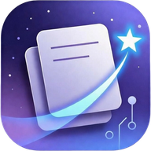

<div align="center">



# ✦ 星 叙 ✦
### Star Narration · xint

*让每一个灵感都有机会长成作品*

[](https://1338032.github.io/Star.Narration.xint/)
[](https://1338032.github.io/Star.Narration.xint/)
[](https://1338032.github.io/Star.Narration.xint/)
[](https://1338032.github.io/Star.Narration.xint/)

<br/>

**[🌐 立即使用](https://1338032.github.io/Star.Narration.xint/)** · **[📦 下载 APK](https://1338032.github.io/Star.Narration.xint/syn.apk)** · **[📖 使用指南](https://1338032.github.io/Star.Narration.xint/Basic-Tutorial.md)**

<br/>

> 星叙是一款专为**网文创作者**打造的智能写作工具。  
> 无需注册、数据本地存储、永久免费——你的故事，由你掌控。

</div>

---

## 📢 星叙的创作立场声明

**星叙从诞生之初，就明确反对**用 AI 批量生成低质内容、刷平台、代笔代写等行为。

我开发这个工具的初心，**不是为了让 AI 代替人类写作**，而是希望给真正热爱创作的人，提供一个**强大、私密、好用的辅助创作工作室**。

我坚信：

> **好的故事永远来自作者的真情实感、人生经历和独特思考，AI 无法取代。**

AI 应该是创作者的**“灵感伙伴”**和**“高效助手”**，而不是写作的主体。

最终呈现在读者面前的每一部作品，都应该由**作者本人**主导把控、修改打磨，并对内容负责。

星叙的所有功能设计（伏笔追踪、精华压缩器、星笺、世界观管理、版本历史等），都是为了帮助作者**更好地思考、更好地规划、更好地完善**自己的故事，而不是一键生成完事。

**如果您也认同“人类创作 + AI 辅助”的理念**，欢迎使用星叙。  

**如果您期待的是完全由 AI 自动生成小说然后直接发布的工具**，那么星叙**并不适合您**。

我会继续把星叙做成一个**尊重创作者、尊重原创**的工具，也欢迎大家在合理使用的前提下，一起维护健康、良性的创作生态。

⭐️ 感谢每一位真正用心创作的朋友，是你们让这个工具有了存在的意义。

---

## ✨ 核心功能

<table>
  <tr>
    <td width="50%">
      <h3>🤖 AI 智能续写</h3>
      <p>接入自定义 AI 接口，根据你的故事风格、人物设定、世界观自动续写。支持流式输出、续写质量评分、一键重试。</p>
    </td>
    <td width="50%">
      <h3>🧵 伏笔追踪器</h3>
      <p>为每一根伏笔建档，追踪埋设位置与回收状态，再也不用担心写着写着把坑忘了。</p>
    </td>
  </tr>
  <tr>
    <td>
      <h3>🗂️ 完整设定管理</h3>
      <p>人物预设、世界观、文风规则、章节大纲……所有创作素材集中管理，AI 续写时自动引用。</p>
    </td>
    <td>
      <h3>📦 资源广场</h3>
      <p>将你的人物、世界观、文风打包成资源包，一键分享或导入社区资源，快速启动新故事。</p>
    </td>
  </tr>
  <tr>
    <td>
      <h3>🎭 角色扮演（RP）</h3>
      <p>与你笔下的角色对话，感受人物性格，探索支线故事，让创作更有温度。</p>
    </td>
    <td>
      <h3>📝 星笺</h3>
      <p>独创灵感便签系统，随手记录碎片想法，自动按标签整理，灵感不再溜走。</p>
    </td>
  </tr>
  <tr>
    <td>
      <h3>⏱️ 时间线管理</h3>
      <p>可视化管理作品内的时间轴，自动检测"同一天从下午跳到上午"等时间逻辑矛盾。</p>
    </td>
    <td>
      <h3>🔬 精华压缩器</h3>
      <p>将长篇内容智能压缩提炼，精准输入 AI 上下文，续写更连贯，不再跑偏。</p>
    </td>
  </tr>
</table>

---

## 🚀 更多亮点

| 功能 | 说明 |
|------|------|
| 🔍 **全局搜索** | 跨所有作品、笔记、伏笔、时间线、收藏夹搜索，一键跳转 |
| 📚 **章节版本管理** | 每章最多保存 20 个历史版本，随时对比或回滚 |
| 🎙️ **TTS 语音朗读** | 沉浸式朗读模式，边听边检查作品节奏 |
| ✍️ **AI 查错别字** | 一键检测全文错别字，点击直接跳转定位 |
| 🌏 **番外篇生成** | 基于已完结作品，一键续写番外故事 |
| 📊 **写作统计** | 字数占比、作品数、创作目标等数据可视化 |
| 🖋️ **文风分析** | 分析你的写作风格特征，统一多部作品的文风 |
| 📱 **沉浸式阅读** | 无干扰全屏阅读模式，专注享受自己的作品 |
| 🔤 **自定义字体** | 内置多款中文字体可选，打造专属阅读体验 |
| 💾 **数据备份还原** | 一键导出全部数据（作品、笔记、设定），安全无忧 |

---

## 🎨 界面主题

星叙内置 **5 种配色方案** × **2 种明暗模式**，总有一款适合你的创作氛围：

| 主题 | 色调 |
|------|------|
| 🟣 默认紫 | `#6c5ce7` · `#a29bfe` |
| 🔵 深海蓝 | `#2980b9` · `#5dade2` |
| 🟢 森林绿 | `#27ae60` · `#58d68d` |
| 🟠 暖阳橙 | `#e67e22` · `#f0b27a` |
| ⬜ 浅色模式 | 护眼纯白风格 |

---

## 📲 安装与使用

### 方式一：直接访问（推荐）

打开浏览器，访问 👉 **[https://1338032.github.io/Star.Narration.xint/](https://1338032.github.io/Star.Narration.xint/)**

### 方式二：安装为 PWA（桌面 / 手机）

在 Chrome / Safari 中打开网址后：

- **手机**：点击「分享」→「添加到主屏幕」
- **电脑**：点击地址栏右侧的安装图标

即可像原生 App 一样使用，支持离线访问。

### 方式三：Android APK

直接下载安装包，在 Android 设备上原生运行：

```
https://1338032.github.io/Star.Narration.xint/syn.apk
```

---

## 🔒 隐私与安全

- **数据本地存储**：所有创作内容、设定、笔记均保存在你的设备本地，不上传任何服务器
- **API 密钥安全**：你填写的 AI 接口密钥仅存储在本地，不经过任何第三方
- **无需注册账号**：打开即用，没有任何账号绑定

---

## 💡 快速上手

```
1. 打开星叙网页
2. 在「设定」中填入你的 AI API 密钥（支持各类兼容 OpenAI 格式的接口）
3. 在「作坊」中新建一部作品，填写人物、世界观设定
4. 在编辑器中写下第一段，点击「AI 续写」——开始你的故事！
```

> 💬 **新手提示**：首次使用建议先阅读内置的「使用指南」（右上角菜单可进入），15 分钟即可上手全部核心功能。

---

## 🛠️ 技术特性

- **纯前端单文件应用**，零后端依赖，部署极简
- 支持 **PWA**（Progressive Web App），可离线使用
- **IndexedDB / localStorage** 本地持久化存储
- 兼容 **OpenAI 格式** API，可对接 GPT、Claude、DeepSeek 等多种模型
- 响应式设计，完美适配手机、平板、桌面

---

## 📬 联系作者

> 作者：**心田**

| 平台 | 联系方式 |
|------|----------|
| 📮 邮箱 | a13380324832@qq.com |
| 💬 QQ | 962005530 |
| 📕 小红书 | 95567118758 / 27418565861 |

欢迎提交 Issue 反馈 Bug 或建议新功能！

---

## ⚖️ 版权声明

本项目的以下独创性功能模块受著作权法保护：**星笺、精华压缩器、上下文设置、伏笔追踪器、资源广场、高级创作**及其他具有原创性的功能设计与交互方式。

**禁止**任何形式的抄袭、仿制、套壳或实质性相似复用。

用户通过本工具创作的内容（故事、文字等）归用户本人所有。

---

<div align="center">

**⭐ 如果星叙对你有帮助，欢迎点个 Star！**

*v1.4.4 · Created with ❤️ by 心田*

</div>

<div align="center">


# ✦ Star Narration ✦
### 星叙 · xint

*Let every spark of inspiration have the chance to become a full story*

[](https://1338032.github.io/Star.Narration.xint/)
[](https://1338032.github.io/Star.Narration.xint/)
[](https://1338032.github.io/Star.Narration.xint/)
[](https://1338032.github.io/Star.Narration.xint/)

<br/>

**[🌐 Open App](https://1338032.github.io/Star.Narration.xint/)** · **[📦 Download APK](https://1338032.github.io/Star.Narration.xint/syn.apk)** · **[📖 Guide](https://1338032.github.io/Star.Narration.xint/Basic-Tutorial.md)**

<br/>

> Star Narration is an intelligent writing tool designed for **web novel creators**.  
> No registration required, local data storage, completely free — your stories belong to you.

</div>

---

## 📢 Creative Philosophy Statement

From its very beginning, Star Narration clearly opposes the use of AI for mass-generating low-quality content, spam publishing, or ghostwriting.

The purpose of this tool is **not to replace human writing**, but to provide passionate creators with a **powerful, private, and convenient creative workspace**.

I firmly believe:

> **Great stories always come from the author’s real emotions, life experiences, and unique thinking — AI cannot replace that.**

AI should serve as a **creative companion and assistant**, not the main author.

Every published work should still be **guided, edited, and refined by the creator**, who is responsible for its content.

All features in Star Narration (foreshadow tracking, essence compressor, Star Notes, worldbuilding system, version history, etc.) are designed to help authors **think better, plan better, and refine better**, not to generate finished works in one click.

If you agree with the idea of **“human creativity + AI assistance”**, you are welcome to use Star Narration.

If you are looking for a tool that automatically generates novels for direct publishing, then Star Narration is **not suitable for you**.

We will continue building this tool with respect for creators and originality, and we welcome everyone to help maintain a healthy creative ecosystem.

⭐ Thank you to every dedicated creator — you are the reason this tool exists.

---

## ✨ Core Features

| Feature | Description |
|--------|-------------|
| 🤖 AI Writing Assistant | Custom AI integration for story continuation based on style, characters, and worldbuilding. Supports streaming output, quality scoring, and retry. |
| 🧵 Foreshadow Tracker | Track every foreshadowing element with placement and resolution status to avoid forgotten plot threads. |
| 🗂️ Worldbuilding Manager | Centralized management of characters, worlds, writing style rules, and outlines. Automatically referenced during AI generation. |
| 📦 Resource Hub | Package characters, worlds, and styles into reusable bundles for sharing or importing. |
| 🎭 Roleplay Mode | Interact with your characters and explore side stories through dialogue. |
| 📝 Star Notes | Capture fragmented inspiration and auto-organize via tags. |
| ⏱️ Timeline Manager | Visual timeline system with automatic detection of chronological inconsistencies. |
| 🔬 Essence Compressor | Summarize long content into optimized context for AI continuity. |

---

## 🚀 More Highlights

| Feature | Description |
|--------|-------------|
| 🔍 Global Search | Search across all stories, notes, foreshadowing, timelines, and favorites |
| 📚 Chapter Versioning | Up to 20 saved versions per chapter with comparison and rollback |
| 🎙️ TTS Reading Mode | Immersive text-to-speech reading experience |
| ✍️ AI Proofreading | One-click typo detection and correction |
| 🌏 Side Story Generator | Generate spin-off stories based on completed works |
| 📊 Writing Analytics | Statistics for word count, projects, and creative goals |
| 🖋️ Writing Style Analysis | Analyze and unify writing style across works |
| 📱 Immersive Reading Mode | Fullscreen distraction-free reading experience |
| 🔤 Custom Fonts | Multiple built-in fonts for personalized reading |
| 💾 Data Backup & Restore | Export all data safely with one click |

---

## 🎨 UI Themes

Star Narration includes **5 color themes × 2 light/dark modes**, offering a comfortable creative environment:

| Theme | Colors |
|------|--------|
| 🟣 Default Purple | `#6c5ce7` · `#a29bfe` |
| 🔵 Deep Ocean Blue | `#2980b9` · `#5dade2` |
| 🟢 Forest Green | `#27ae60` · `#58d68d` |
| 🟠 Warm Orange | `#e67e22` · `#f0b27a` |
| ⬜ Light Mode | Clean white aesthetic |

---

## 📲 Installation & Usage

### Option 1: Web App (Recommended)

Visit 👉 https://1338032.github.io/Star.Narration.xint/

### Option 2: Install as PWA

Open in Chrome / Safari:

- Mobile: Share → Add to Home Screen  
- Desktop: Click install icon in address bar  

Works like a native app with offline support.

### Option 3: Android APK

Download directly and install:

https://1338032.github.io/Star.Narration.xint/syn.apk

---

## 🔒 Privacy & Security

- **Local storage only**: All works and data are stored on your device
- **No account required**
- **API keys stored locally only**
- No data is uploaded to any server

---

## 💡 Quick Start

```
1.Open 5tar Narration in your browser
2. Add your AI API key in settings
(OpenAl-compatible APIs supported)
3.Create a new project and define characters/
worldbuilding
4. Write your first paragraph
5.Click “AI Continue”t to begin generating
your story
```

> 💬 Beginner tip: Check the built-in “Guide” (top-right menu). You can learn everything in about 15 minutes.

---

## 🛠️ Technical Details

- Pure frontend single-page application
- No backend dependency
- Supports PWA offline mode
- IndexedDB / localStorage persistence
- Compatible with OpenAI-style APIs (GPT / Claude / DeepSeek etc.)
- Fully responsive design (mobile / tablet / desktop)

---

## 📬 Contact

> Author: **心田**

| Platform | Contact |
|----------|--------|
| 📮 Email | a13380324832@qq.com |
| 💬 QQ | 962005530 |
| 📕 Xiaohongshu | 95567118758 / 27418565861 |

Feedback and suggestions are welcome via issues or messages.

---

## ⚖️ License Notice

The following original modules are protected by copyright: Star Notes, Essence Compressor, Context System, Foreshadow Tracker, Resource Hub, and other uniquely designed features and interaction systems.

Unauthorized copying, cloning, or derivative reproduction is prohibited.

Content created by users belongs to the users themselves.

---

<div align="center">

**⭐ If Star Narration helps you, please consider giving it a Star!**

*v1.4.4 · Created with ❤️ by 心田*

</div>
